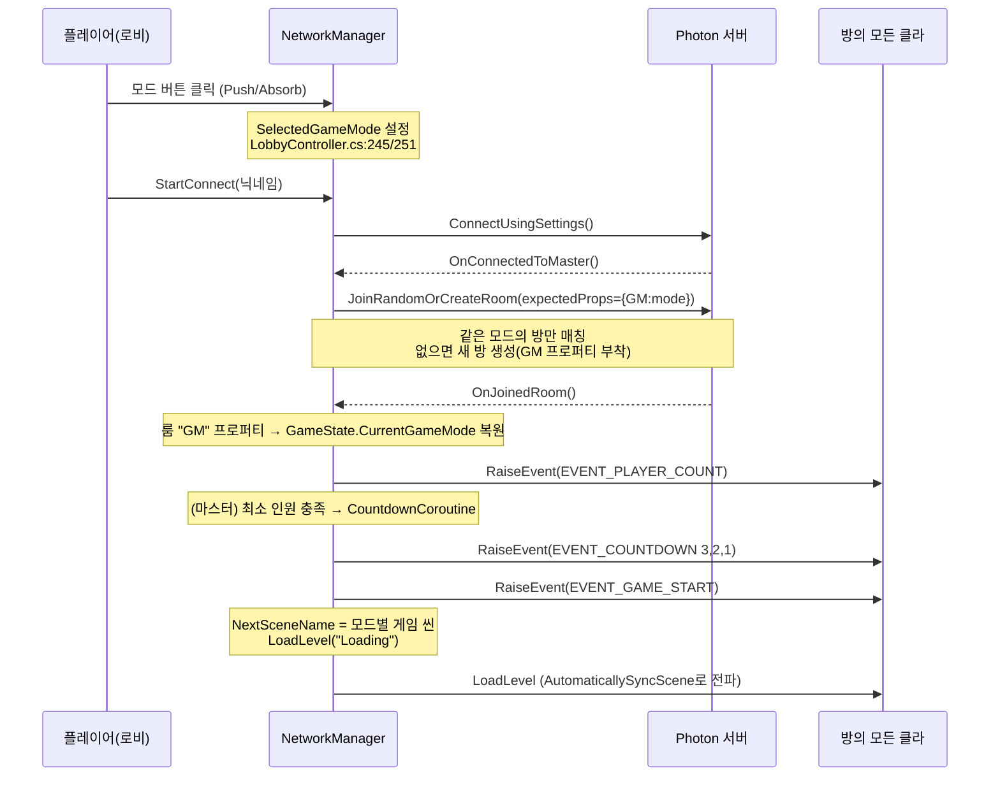
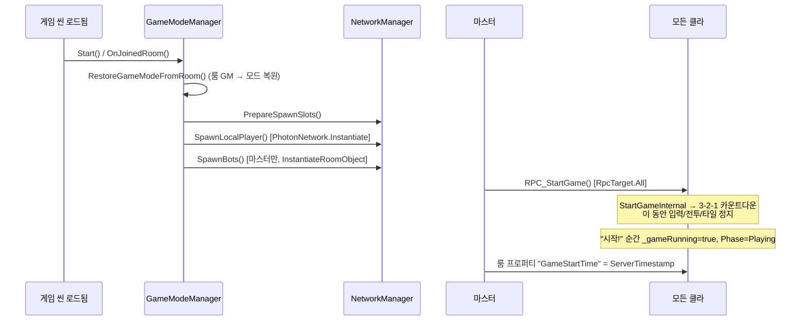
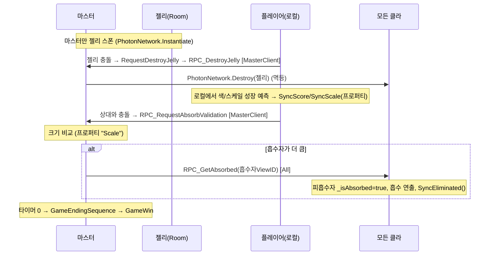
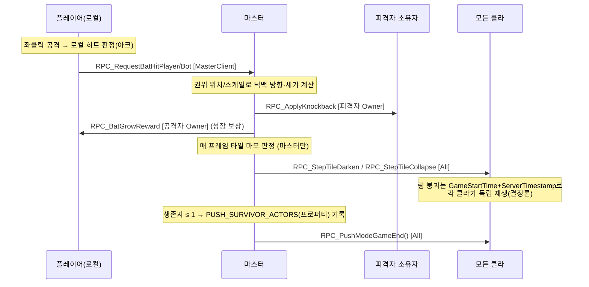
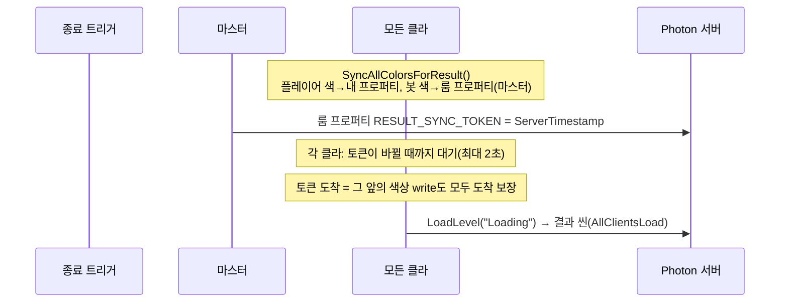

# JellyGameProject 네트워크 기술 명세서 (Photon PUN2)

> 대상: JellyGameProject (Unity · Photon PUN2 기반 .io 멀티플레이)
> 범위: **게임 진행 순서(Photon 시퀀스)** 와 **동기화 3방식의 적용 근거**를, 실제 코드에 근거해 기술한다.
> 두 게임 모드(**흡수 Absorb / 밀치기 Push**)를 나누어 설명한다.
> 코드 위치는 `파일명:라인` 으로 표기한다(2026-07-18 기준 IO 브랜치).

---

## 0. 한눈에 보기 — 핵심 결론 3줄

1. **권위 모델은 "마스터 클라이언트 권위(Master-authoritative)"** 다. 판정(흡수·밀치기·타일 붕괴·생존자)은 항상 마스터가 내리고, 다른 클라는 결과를 통보받는다.
2. **동기화 채널을 값의 성격에 따라 3+2가지로 분담**한다 — 연속값은 스트림, 지속 상태는 프로퍼티, 사건은 RPC.
3. **설계 3원칙은 권위(Authority) · 멱등(Idempotency) · 결정론(Determinism)** 이며, 코드 곳곳의 `IsMasterClient` 가드, `_isAbsorbed`/`_tiles[x,z]==null` 중복 가드, `ServerTimestamp` 기반 시계 동기화가 각각의 구현이다.

---

## 1. 네트워크 아키텍처 개요

### 1.1 오브젝트 소유권(Ownership) 모델

| 오브젝트 | 생성 방식 | 소유자(Owner) | `IsMine == true`인 클라 | 근거 |
|---|---|---|---|---|
| 로컬 플레이어 | `PhotonNetwork.Instantiate` | 각 플레이어 본인 | 본인 클라 | `NetworkManager.cs:591` |
| AI 봇 | `PhotonNetwork.InstantiateRoomObject` | **룸(=마스터)** | 마스터 클라 | `NetworkManager.cs:632` |
| 젤리(흡수 모드) | `PhotonNetwork.Instantiate` (마스터만) | 마스터 | 마스터 클라 | `NetworkJellyManager.cs:150` |

> **왜 봇은 `InstantiateRoomObject`인가?** 일반 `Instantiate`로 만든 오브젝트는 생성한 클라가 나가면 파괴된다. 봇은 특정 사람에 종속되면 안 되므로 **룸 소유 오브젝트**로 만들어, 마스터가 바뀌어도 봇이 사라지지 않고 새 마스터가 소유권을 이어받는다.

### 1.2 마스터 권위(Authority) 원칙

- **"물리 이벤트는 로컬 사건, 게임 상태 변경은 소유자/마스터의 권한"** 이 일관된 규율이다.
- 클라이언트는 "내가 A를 흡수한 것 같다"를 **요청(request)** 할 뿐이고, 실제 판정은 마스터가 크기를 비교해 내린 뒤 **결과를 브로드캐스트**한다.
  - 예) `RPC_RequestAbsorbValidation` → (마스터가 검증) → `RPC_GetAbsorbed`. `NetworkPlayerSync.cs:345, 456-472`

### 1.3 씬 동기화

- `PhotonNetwork.AutomaticallySyncScene = true` (`NetworkManager.cs:116`) — **마스터가 `LoadLevel`하면 나머지 클라가 자동으로 같은 씬을 따라 로드**한다.
- 결과 씬 전환만은 예외적으로 "모든 클라가 각자 `LoadLevel`"(`AllClientsLoad`)한다 → 마스터가 먼저 탈락해도 데드락이 없도록. (`LoadingSceneController.cs:34, 166`)

---

## 2. 전체 진행 시퀀스 (Photon 관점)

### 2.1 [공통] 접속 → 모드 선택 → 매칭 → 카운트다운 → 씬 로드



**코드 근거**

| 단계 | 코드 | 핵심 |
|---|---|---|
| 모드 선택 | `LobbyController.cs:245` `SelectedGameMode = Push` / `:251` `Absorb` | 버튼이 로컬 의도(SelectedGameMode)를 지정 |
| 접속 | `NetworkManager.cs:165` `PhotonNetwork.ConnectUsingSettings()` | |
| 접속 성공 콜백 | `NetworkManager.cs:199` `OnConnectedToMaster()` → `JoinOrCreateRoom()` | |
| 방 매칭 | `NetworkManager.cs:234` `JoinRandomOrCreateRoom(expectedProps={GM})` | **모드가 같은 방끼리만** 매칭 |
| 입장 콜백 | `NetworkManager.cs:247` `OnJoinedRoom()` | 룸 프로퍼티 `GM` → `GameState.CurrentGameMode`(`:251-259`) |
| 카운트다운 | `NetworkManager.cs:327` `CountdownCoroutine()` (마스터만, `:288`) | `RaiseEvent`로 3-2-1 브로드캐스트 |
| 봇 수 확정 | `NetworkManager.cs:355` `botCount = maxPlayers - PlayerCount` | 빈 자리를 봇으로 채움 |
| 씬 로드 | `NetworkManager.cs:357-362` `NextSceneName=모드씬; LoadLevel("Loading")` | 로딩 씬을 경유 |

> **모드 정보의 "이중 출처"에 주의(설계 포인트).** `SelectedGameMode`(정적, "내가 누르려던 모드")와 룸 프로퍼티 `GM`(권위, "실제 입장한 방의 모드")은 다르다. `expectedCustomRoomProperties` 덕에 대개 일치하지만, **모든 클라가 같아야 하는 씬 결정 같은 값은 반드시 룸 권위값(`GameState.CurrentGameMode`)에서 파생**한다. (`LoadingSceneController.cs:67-71`, `NetworkManager.cs:179`)

### 2.2 [공통] 게임 씬 진입 → 스폰 → 시작 카운트다운



**코드 근거**

| 단계 | 코드 | 핵심 |
|---|---|---|
| 씬 진입 | `GameModeManager.cs:106-114` `Start()`/`OnJoinedRoom()` → `SpawnAndStartGame()` | |
| 모드 복원 | `GameModeManager.cs:156` `RestoreGameModeFromRoom()` | 씬 로드 중 `GameState.Reset()`이 모드를 Absorb로 되돌리므로 **룸 권위값에서 재복원**(안 하면 Push인데 좌클릭 공격이 안 됨) |
| 스폰 순서 | `GameModeManager.cs:159-161` 슬롯 준비 → 로컬 플레이어 → 봇 | 슬롯 인덱스는 `PlayerList` 정렬 순서로 배분(입·퇴장 반복에도 충돌 없음, `NetworkManager.cs:563-575`) |
| 시작 신호 | `GameModeManager.cs:163-166` 마스터 → `RPC_StartGame(All)` | |
| 시작 카운트다운 | `GameModeManager.cs:195-240` `StartCountdownRoutine()` | 3-2-1 동안 `_gameRunning=false`·`InputLocked=true`, "시작!"에 `Phase=Playing` |
| 붕괴 기준 시각 | `GameModeManager.cs:228` `SetCustomProperties({GameStartTime: ServerTimestamp})` | **모든 클라가 공유하는 절대 시각** → 결정론적 타일 붕괴의 기준점 |

### 2.3 [흡수 모드] 인게임 루프

핵심 루프: **젤리를 먹어 커지고 → 나보다 작은 상대를 흡수 → 제한 시간(180s) 생존.**



**코드 근거**

| 단계 | 코드 | 핵심 |
|---|---|---|
| 젤리 스폰 | `NetworkJellyManager.cs:79-84, 90-122` `SpawnRoutine()` | **마스터만** 스폰. 개수는 `EntityRegistry.Jellies.Count`(전 클라 공유)로 판단 → 마스터 교체 시 과다 생성 방지 |
| 젤리 삭제 | `NetworkJellyManager.cs:272-297` `RequestDestroyJelly` → `RPC_DestroyJelly[MasterClient]` → `PhotonNetwork.Destroy` | 삭제 권한을 마스터로 단일화. `Destroy`는 **멱등**이라 중복 요청 안전 |
| 플레이어 흡수 요청 | `NetworkPlayerSync.cs:336-359` `OnTriggerEnter` → `RPC_RequestAbsorbValidation/RPC_RequestBotAbsorbValidation [MasterClient]` | 로컬은 "요청"만. `IsMine`·`Phase==Playing`·`Absorb`모드 가드 |
| 마스터 검증 | `NetworkPlayerSync.cs:456-500` | **권위 스케일**(`GetAuthorityScale`=프로퍼티 "Scale")로 비교 후 승자 확정 |
| 흡수 확정 | `NetworkPlayerSync.cs:523-552` `RPC_GetAbsorbed [All]` | `_isAbsorbed` 가드로 **중복 흡수 차단**, `SyncEliminated()`로 탈락 기록 |
| 종료 | `GameModeManager.cs:259-267` 타이머 → `GameEndingSequenceRoutine` → `GameWin()`(`:416`) | 시간이 종료 트리거 |

### 2.4 [밀치기 모드] 인게임 루프

핵심 루프: **배트/대쉬로 상대를 밀고 → 발판(타일)이 밟을수록 무너져 → 마지막 1명까지 생존(라스트 맨 스탠딩).**



**코드 근거**

| 단계 | 코드 | 핵심 |
|---|---|---|
| 젤리 없음 | `NetworkJellyManager.cs:73-77` Push 모드는 스폰 안 함 | (마스터 교체 콜백에도 동일 가드 `:311`) |
| 배트 히트 요청 | `NetworkPlayerSync.cs:798, 825` `RPC_RequestBatHitPlayer/Bot [MasterClient]` | 로컬 명중 → 마스터에 검증 요청 |
| 넉백 적용 | `NetworkPlayerSync.cs:817` `RPC_ApplyKnockback [victim Owner]` | 피격자 **소유자에게만** 전송(All로 보내면 지터) |
| 성장 보상 | `NetworkPlayerSync.cs:821, 853` `RPC_BatGrowReward [attacker Owner]` | |
| 타일 마모 판정 | `TileCollapseManager.cs:200-221` `UpdateStepCollapse()` (마스터만) | 밟은 경로를 라인으로 훑어(`WearTilePath:264`) 대쉬로 건너뛴 칸도 마모 |
| 마모 전파 | `TileCollapseManager.cs:312-319` → `GameModeManager.cs:781-791` `RPC_StepTileDarken/Collapse [All]` | 색 어둡게 / 붕괴를 전 클라에 전파 |
| 링 붕괴(시간) | `GameModeManager.cs:803-813` `NetworkedElapsedTime` (`GameStartTime` 기반) | **RPC 폭주 없이** 절대 시각으로 각 클라 독립 재생 |
| 종료 판정 | `GameModeManager.cs:699-734` `CheckLastSurvivor()` (마스터, 매 60프레임) | 생존자 목록을 프로퍼티에 기록 후 `RPC_PushModeGameEnd(All)` |

> **밀치기 모드에서 "로컬 플레이어 사망"은 게임 종료가 아니라 관전 전환이다.** 마스터에서 `_gameRunning`을 끄면 타일 붕괴·전투 검증·생존자 판정이 전부 멈춰 살아남은 사람의 발판이 얼어붙는다. 그래서 사망 시 **권위 시뮬레이션은 유지**하고 입력만 차단한다. 실제 종료는 `CheckLastSurvivor`가 담당한다. (`GameModeManager.cs:526-547`)

### 2.5 [공통] 게임 종료 → 결과 씬 전환



**코드 근거**

| 단계 | 코드 | 핵심 |
|---|---|---|
| 색/스케일 저장 | `GameModeManager.cs:505-524` `SyncAllColorsForResult()` | 오브젝트가 파괴돼도 **프로퍼티로 결과 씬에 색 전달** |
| 동기화 토큰 | `GameModeManager.cs:454-490` `LoadResultSceneAfterSync()` | 룸 프로퍼티는 **순서 보장 채널** → "새 토큰 도착 = 그 앞 write 전부 도착"을 이용한 배리어 |
| 생존자 권위 | `GameModeManager.cs:729` `PUSH_SURVIVOR_ACTORS_KEY`(프로퍼티) | 결과 씬은 각자의 "Eliminated" 대신 **마스터 권위 목록**을 신뢰 |
| 씬 전환 | `LoadingSceneController.cs:160-168` | 결과 전환은 `AllClientsLoad`=모든 클라 직접 로드(마스터 탈락 데드락 방지) |

---

## 3. 세 가지 동기화 방식과 선택 근거 ⭐ (핵심)

> `NetworkPlayerSync.cs:6-12` 헤더가 이 분담을 그대로 선언한다:
> ```
> // 동기화 분담:
> //   - 위치/회전 → PhotonTransformView
> //   - 애니메이션 → PhotonAnimatorView
> //   - 스케일/점수 → CustomProperties (State Sync)
> //   - 색상 → IPunObservable 스트림
> //   - 흡수 판정 → RPC (MasterClient 검증)
> ```

### 3.1 요약 표 — "무엇을 / 어떤 방식 / 왜"

| 동기화 대상 | 방식 | 왜 이 방식인가 (선택 근거) |
|---|---|---|
| 위치·회전 | PhotonTransformView (컴포넌트) | 매 틱 부드럽게 바뀌는 값 → 스트림+보간 최적 |
| 애니메이션 파라미터 | PhotonAnimatorView (컴포넌트) | 상태기계 파라미터 자동 스트림 |
| **색상** | **`OnPhotonSerializeView`** (스트림) | 연속적으로 변할 수 있는 시각값을 관찰 스트림으로 |
| **스케일·점수·모드·탈락** | **`CustomProperties`** (상태) | **늦게 입장/마스터 교체에도 최신값 보장**, 판정의 **단일 권위 출처** |
| **흡수·밀치기·타일·젤리삭제** | **`RPC`** (이벤트) | 특정 순간의 **사건**, 마스터 검증·멱등 처리 |
| (보조) 인원수·매칭 카운트다운 | `RaiseEvent` | 룸 오브젝트가 생기기 전 로비 단계의 가벼운 브로드캐스트 |

### 3.2 방식 ① `OnPhotonSerializeView` (IPunObservable) — 연속 스트림

**정의:** `IPunObservable`을 구현하면 PUN이 주기적으로 `OnPhotonSerializeView`를 호출한다. 소유자는 `stream.SendNext`로 쓰고, 원격 클라는 `stream.ReceiveNext`로 받는다. **자동·주기적**으로 흐르는 파이프라인이다.

**무엇에 썼나:** 플레이어의 **디스플레이 색상**(RGBA 4개 float).

```csharp
// NetworkPlayerSync.cs:233
public void OnPhotonSerializeView(PhotonStream stream, PhotonMessageInfo info)
{
    if (!PhotonNetwork.InRoom) return;
    if (stream.IsWriting)                 // 내가 소유자 → 값 송신
    {
        Color myColor = GameState.CurrentDisplayColor;
        stream.SendNext(myColor.r); stream.SendNext(myColor.g);
        stream.SendNext(myColor.b); stream.SendNext(myColor.a);
    }
    else                                  // 원격 → 값 수신
    {
        float r = (float)stream.ReceiveNext(); /* g,b,a ... */
        _networkColor = new Color(r, g, b, 1f);
    }
}
```
수신한 `_networkColor`는 `Update()`에서 원격 젤리 머티리얼에 반영된다(`NetworkPlayerSync.cs:198-226`).

**선택 근거:**
- 색은 **소유자만 아는 로컬 시각 상태**이고, 원격은 "최근 값을 계속 따라오면" 되는 성격 → **스트림+상태 팔로우**가 자연스럽다.
- RPC처럼 "한 번의 사건"이 아니라 "지속적으로 존재하는 값"이므로 관찰(observe) 모델이 맞다.

> **트레이드오프(정직하게):** 색은 실제로는 거의 안 변하는데 매 틱 4-float를 흘려보내므로 대역폭이 다소 낭비된다. "변할 때만 프로퍼티/RPC로 전파"하는 방식이 더 알뜰하다(개선 후보). 즉 **"연속적으로 자주 변하는가?"** 가 스트림을 고를 때의 핵심 질문이다.

### 3.3 방식 ② `CustomProperties` — 상태(State) 동기화

**정의:** 룸(Room) 또는 플레이어(Player)에 붙는 **키-값 딕셔너리**. 서버가 보관하며, **신뢰성 있고 순서가 보장되는 채널**로 전파된다. 늦게 들어온 클라도 즉시 최신 스냅샷을 읽는다.

**무엇에 썼나 (2계층):**

*Player 프로퍼티 (개인 상태)* — `NetworkPlayerSync.cs`
```csharp
// 점수·스케일 (SyncScore:260 / SyncScale:273)
props = { {"Score", newScore}, {"Scale", scaleController.currentScaleValue} };
PhotonNetwork.LocalPlayer.SetCustomProperties(props);
// 색상(결과용) Color_R/G/B (SyncColor:289), 탈락 Eliminated (SyncEliminated:303)
```

*Room 프로퍼티 (전역 권위 상태)*
| 키 | 의미 | 위치 |
|---|---|---|
| `GM` | 게임 모드(Push/Absorb) | `NetworkManager.cs:224` |
| `GameStartTime` | 실제 시작 절대 시각(ServerTimestamp) | `GameModeManager.cs:228` |
| `ResultSyncToken` | 결과 색 write 완료 배리어 | `GameModeManager.cs:476` |
| `PushSurvivorActors` | 마스터 권위 생존자 목록 | `GameModeManager.cs:729` |
| `Bot{id}_Scale/_Score/_Name/_Color` | 봇 리더보드/판정값 | `AIPlayerSync.cs:65-114` |

**판정은 항상 이 권위값을 읽는다:**
```csharp
// NetworkPlayerSync.cs:625  — 흡수/밀치기 크기 비교의 단일 출처
private static float GetAuthorityScale(PhotonView pv)
{
    if (pv.Owner?.CustomProperties != null &&
        pv.Owner.CustomProperties.TryGetValue("Scale", out object val))
        return (float)val;
    return pv.transform.localScale.x;  // 폴백
}
```

**선택 근거:**
- **지속 상태(persistent state)** 이기 때문. transform처럼 매 틱 흐르는 값이 아니라, **성장/탈락처럼 띄엄띄엄 바뀌는 "현재 상태"** 다.
- **늦은 입장·마스터 교체에 강함.** 스트림/RPC는 "그 순간 방에 있던 사람만" 받지만, 프로퍼티는 서버가 들고 있어 **나중에 읽어도 최신값**이다. 그래서 크기 판정·게임 모드·결과 색을 여기에 둔다.
- **판정의 단일 출처.** 보간 중인 `transform.localScale`은 클라마다 다르지만, 프로퍼티 "Scale"은 모두 같은 값 → 흡수 승패가 클라마다 갈리지 않는다.
- **순서 보장 채널** 이라 배리어로도 쓸 수 있다(결과 동기화 토큰, `:454-490`).

### 3.4 방식 ③ `RPC` — 이벤트/일회성 상태 변경 (+ 마스터 검증)

**정의:** `[PunRPC]` 메서드를 `photonView.RPC(...)`로 원격 호출. **특정 순간에 한 번 발생하는 사건**을 대상에게(특정 클라/마스터/전체) 전달한다. `RpcTarget`으로 수신자를 정밀 지정한다.

**무엇에 썼나:** 흡수 판정, 밀치기/넉백, 타일 붕괴, 젤리 삭제, 애니메이션 트리거, 탈락 전파, 게임 시작/종료.

**핵심 패턴 — "요청 → 마스터 검증 → 결과 브로드캐스트":**
```csharp
// 1) 로컬: 마스터에게 "흡수한 것 같다" 요청 (NetworkPlayerSync.cs:345)
photonView.RPC(nameof(RPC_RequestAbsorbValidation), RpcTarget.MasterClient, otherViewID);

// 2) 마스터: 권위 스케일로 검증 후 승자에게만 확정 통보 (:456)
if (absorberScale > victimScale)
    photonView.RPC(nameof(RPC_GetAbsorbed), RpcTarget.All, absorberViewID);

// 3) 전 클라: 흡수 연출 — 중복 가드로 멱등 (:523)
private void RPC_GetAbsorbed(int absorberViewID) {
    if (_isAbsorbed) return;   // ← 두 번 와도 한 번만
    _isAbsorbed = true; ...
}
```

**`RpcTarget` 선택의 근거 (이 프로젝트의 규율):**
| 대상 | 언제 | 예시 |
|---|---|---|
| `MasterClient` | 판정을 요청할 때 | `RPC_RequestAbsorbValidation`(`:345`) |
| `All` | 판정 결과·연출·게임 상태를 모두에게 | `RPC_GetAbsorbed`·`RPC_StartGame`·`RPC_StepTileCollapse` |
| `특정 Owner` | 그 오브젝트의 소유자만 transform을 움직여야 할 때 | `RPC_ApplyKnockback`(피격자 Owner, `:817`) — All로 보내면 원격에서 지터 |

**선택 근거:**
- **사건(event)** 이기 때문. "흡수가 일어났다", "타일이 무너졌다"는 지속 상태가 아니라 순간적 트리거 → RPC가 맞다.
- **마스터 검증으로 일관성/치팅 방지.** 크기 비교를 각자 하면 클라마다 결과가 갈리므로, 판정을 마스터 한 곳에 모은다.
- **멱등(idempotency) 설계로 중복 안전.** `RPC_DestroyJelly`(`PhotonNetwork.Destroy`는 멱등), `RPC_GetAbsorbed`(`_isAbsorbed` 가드), `CollapseStepTile`(`_tiles[x,z]==null` 가드) — 같은 RPC가 두 번 와도 상태가 깨지지 않는다.

### 3.5 (보조) `RaiseEvent` — 매칭 단계 브로드캐스트

RPC는 특정 PhotonView 오브젝트가 있어야 하지만, **로비/매칭 단계엔 아직 플레이어 오브젝트가 없다.** 그래서 인원수·카운트다운 같은 신호는 오브젝트에 매이지 않는 `PhotonNetwork.RaiseEvent`로 브로드캐스트하고(`NetworkManager.cs:281, 337, 346`), `LobbyController`가 `IOnEventCallback.OnEvent`로 수신한다(`LobbyController.cs:96`). "오브젝트가 없는 단계의 이벤트"라는 점이 RPC와의 분담 기준이다.

---

## 4. 모드별 차이 요약

| 항목 | 흡수(Absorb) 모드 | 밀치기(Push) 모드 |
|---|---|---|
| 승리 조건 | 제한 시간(180s) 생존 | 마지막 1인 생존(라스트 맨 스탠딩) |
| 젤리 스폰 | O (마스터가 지속 스폰) | X (`NetworkJellyManager.cs:73`) |
| 성장 수단 | 젤리·상대 흡수 | 배트/대쉬 히트 성장 보상 |
| 크기 차 큰 상대 | **흡수**(제거) | **밀치기만**(흡수 없음, `:682/721`) |
| 발판 | 고정 | **밟을수록 붕괴**(타일 마모 + 시간 링 붕괴) |
| 로컬 사망 | 관전 전환 후 곧 결과 | 관전(권위 시뮬 유지) — 게임은 계속 |
| 종료 트리거 | 타이머(`GameEndingSequence`) | 생존자≤1(`CheckLastSurvivor`) |
| 종료 RPC | `GameWin`(로컬 각자) | `RPC_PushModeGameEnd(All)` |
| 결과 씬 | `GameResult_AbsorbMode` | `GameResult_PushMode` |

---

## 5. 설계 3원칙과 학습 포인트 정리

### 원칙 ① 권위(Authority) — "누가 정하는가"를 항상 한 곳으로
- 판정은 마스터가, 오브젝트 상태 변경은 소유자가. 클라는 요청/연출만.
- 구현: 모든 검증 RPC 첫 줄 `if (!PhotonNetwork.IsMasterClient) return;`, 스폰/삭제의 `IsMasterClient` 가드.

### 원칙 ② 멱등(Idempotency) — "두 번 와도 안전한가"
- 네트워크는 순서 역전·중복이 있을 수 있다 → 상태 변경 RPC는 중복 가드를 둔다.
- 구현: `_isAbsorbed`, `_absorbedBotIds`, `_tiles[x,z]==null`, `PhotonNetwork.Destroy`의 멱등성.

### 원칙 ③ 결정론(Determinism) — "모두가 같은 걸 보는가"
- 모두 같아야 하는 값은 **공유 시드/절대 시각/권위 프로퍼티**에서 파생한다.
- 구현: `GameStartTime + ServerTimestamp`로 링 붕괴·초콜릿 흐름을 각 클라가 독립·동일 재생. 스케일 판정은 프로퍼티 단일 출처.

### 채널 선택 3문 (요약)
1. **매 틱 자주 변하는 연속값인가?** → `OnPhotonSerializeView`(스트림) / TransformView
2. **띄엄띄엄 바뀌고, 늦게 와도 최신값이어야 하는 상태인가?** → `CustomProperties`
3. **특정 순간의 사건이고, 마스터가 판정해야 하는가?** → `RPC`(+ MasterClient 검증)

---

### 부록 A. 전체 RPC 목록 (수신자 기준)

| RPC | 위치 | 대상 | 역할 |
|---|---|---|---|
| `RPC_StartGame` | `GameModeManager.cs:170` | All | 게임 시작 초기화·카운트다운 |
| `RPC_PushModeGameEnd` | `GameModeManager.cs:737` | All | 밀치기 종료 |
| `RPC_StepTileDarken/Collapse` | `GameModeManager.cs:782/788` | All | 타일 마모/붕괴 전파 |
| `RPC_DestroyJelly` | `NetworkJellyManager.cs:285` | Master | 젤리 실제 삭제 |
| `RPC_RequestAbsorbValidation` | `NetworkPlayerSync.cs:457` | Master | 흡수 검증 요청 |
| `RPC_RequestBotAbsorbValidation` | `NetworkPlayerSync.cs:475` | Master | 봇 흡수 검증 요청 |
| `RPC_GetAbsorbed` | `NetworkPlayerSync.cs:524` | All | 흡수 확정·연출 |
| `RPC_BotAbsorbConfirmed` | `NetworkPlayerSync.cs:506` | Owner | 봇 흡수 보상 |
| `RPC_RequestDashHitPlayer/Bot` | `NetworkPlayerSync.cs:668/704` | Master | 대쉬 히트 검증 |
| `RPC_RequestBatHitPlayer/Bot` | `NetworkPlayerSync.cs:798/825` | Master | 배트 히트 검증 |
| `RPC_ApplyKnockback` | `NetworkPlayerSync.cs:748` / `AIPlayerMovement.cs:981` | Owner | 넉백 적용 |
| `RPC_BatGrowReward` | `NetworkPlayerSync.cs:854` | Owner | 배트 성장 보상 |
| `RPC_ChocolateElimination` | `NetworkPlayerSync.cs:370` | All | 초콜릿 탈락 전파 |
| `RPC_PlayJump/Dash/Attack` | `NetworkPlayerSync.cs:443/661/760` | Others/All | 애니메이션 트리거 |
| `RPC_OnEliminated` (봇) | `AIPlayerMovement.cs:661` | All | 봇 탈락 전파 |

### 부록 B. 문서 갱신 메모
- 본 명세서는 IO 브랜치 실제 코드(2026-07-18) 기준으로 작성됨.
- 관련 문서: `REVIEW_NOTES.md`(코드 구조 리뷰 이력, F~X 시리즈). 특히 네트워크 관련 개선 후보 S1~S10(동기화 계층)·V6~V7(젤리 스폰)·X1~X3(해저드/타일 권위)를 함께 참고.
