# JellyGameProject Class Diagram

```mermaid
%%{init: {'theme': 'base', 'themeVariables': {'fontSize': '12px'}}}%%

classDiagram
    direction TB

    %% ═══════════════════════════════════════════
    %% NETWORK
    %% ═══════════════════════════════════════════

    namespace Network {
        class NetworkManager {
            +Transform[] spawnPoints
            +Instance : NetworkManager
            +ConnectToServer()
            +CreateRoom()
            +JoinRoom()
            +LeaveRoom()
        }

        class NetworkPlayerSync {
            +PlayerController playerController
            +PlayerAbsorber playerAbsorber
            +PlayerScaleController scaleController
            +float ScaleValue
            +string PlayerName
            +SyncScore(int)
            +SyncScale()
            +GetPlayerSyncedScale(Player) float$
            -GetAuthorityScale(PhotonView) float$
            -GetBotAuthorityScale(AIPlayerMovement) float$
            -RPC_RequestAbsorbValidation(int)
            -RPC_RequestBotAbsorbValidation(int)
            -RPC_GetAbsorbed(int)
            -RPC_BotAbsorbConfirmed(int, float, int)
        }

        class AIPlayerSync {
            +int CurrentScore
            +string BotPrefix
            +AddScore(int)
            +SyncScale(float)
            +GetSyncedScale() float
            +UpdateBotData(string, int, float)
        }

        class NetworkJellyManager {
            +Instance : NetworkJellyManager
            +RequestDestroyJelly(GameObject)
            -SpawnJellies()
        }

        class GameModeManager {
            +Instance : GameModeManager
            +float gameDuration
            +RegisterLocalPlayer(NetworkPlayerSync)
            +OnPlayerAbsorbed(NetworkPlayerSync)
            +OnClickRestartButton()
            -StartGameInternal(float)
            -TryJoinRunningGame()
        }

        class LobbyController {
            <<MonoBehaviourPunCallbacks>>
            <<IOnEventCallback>>
        }

        class LeaderboardEntry {
            +UpdateEntry(int, string, int, bool, bool)
        }
    }

    %% ═══════════════════════════════════════════
    %% PLAYER (Gameplay Core)
    %% ═══════════════════════════════════════════

    namespace Player {
        class PlayerController {
            +Animator jellyAnimator
            +float jumpForce
            +float originalJumpForce
            +ChangeState(PlayerBaseState)
        }

        class PlayerScaleController {
            +float currentScaleValue
            +bool IsScaling
            +Action~float~ OnScaleValueChanged
            +GrowByJelly()
            +GrowByAbsorbing(float)
            +DecreaseScale(float)
            +ResetScale()
        }

        class PlayerAbsorber {
            +Action~JellyColorType~ OnJellyEaten
            +AbsorbColor(JellyColorType)
        }

        class PlayerAbsorbingManager {
            +PlayerAbsorber absorber
            +PlayerScaleController scaleController
            -HandleJellyEaten(JellyColorType)
        }

        class PlayerColorVisual {
            +HandleJellyAbsorbed(JellyColorType)
            +ResetColor()
        }

        class PlayerBridge {
            <<IEntityBridge>>
            +OnScaleInit(float)
            +OnScaleCompleted(float, PlayerController)
            +OnJellyScored()
        }

        class BotBridge {
            <<IEntityBridge>>
        }

        class IEntityBridge {
            <<interface>>
            +OnScaleInit(float)
            +OnGrowEffect(bool)
            +OnShrinkEffect()
            +OnScaleCompleted(float, PlayerController)
            +OnScaleReset()
            +OnJellyScored()
        }

        class PlayerBaseState {
            <<abstract>>
            +Enter()
            +Update()
            +Exit()
        }

        class PlayerIdleState
        class PlayerMoveState
        class PlayerJumpState
    }

    %% ═══════════════════════════════════════════
    %% AI
    %% ═══════════════════════════════════════════

    namespace AI {
        class AIPlayerMovement {
            +NavMeshAgent Agent
            +PlayerScaleController ScaleCtrl
            +AIDetector Detector
            +float CurrentScale
            +int CurrentScore
            +bool IsBeingAbsorbed
            +GetMyAuthorityScale() float
            +ChangeState(AIBaseState)
            +EvaluateAndTransition()
            +TryGetWanderDestination(out Vector3) bool
            +FindThreat() Transform
            +FindPrey() Transform
            -RPC_BotAbsorbed(int)
        }

        class AIDetector {
            +float detectRadius
            +FindThreat() Transform
            +FindPrey() Transform
            +FindTargetToChase() Transform
            +FindNearestJelly() Transform
        }

        class EntityRegistry {
            <<static>>
            +Players : IReadOnlyCollection~NetworkPlayerSync~
            +Bots : IReadOnlyCollection~AIPlayerMovement~
            +Jellies : IReadOnlyCollection~JellyObject~
            +Register()
            +Unregister()
        }

        class AIBaseState {
            <<abstract>>
            +Enter()
            +Update()
            +Exit()
        }

        class AIWanderState
        class AIChaseState
        class AIFleeState
        class AIScaleState

        class WanderingAI {
            <<IPunObservable>>
            +float wanderRadius
            +OnPhotonSerializeView()
        }

        class AIWaypointPatrol {
            <<IPunObservable>>
            +Transform[] waypoints
            +OnPhotonSerializeView()
        }
    }

    %% ═══════════════════════════════════════════
    %% ABSORBING / JELLY
    %% ═══════════════════════════════════════════

    namespace Absorbing {
        class JellyColliderAbsorb {
            +Transform target
            +float absorbSpeed
            +int jellyScore
            +bool absorbing
            +StartAbsorb(Transform)
            -CompleteAbsorption()
            -OnAbsorbed()
        }

        class PlayerAbsorbField {
            +float detectRadius
            +LayerMask jellyLayer
        }

        class JellyObject {
            +JellyColorType jellyType
        }
    }

    %% ═══════════════════════════════════════════
    %% DATA / STATE
    %% ═══════════════════════════════════════════

    namespace DataManagement {
        class GameState {
            <<static>>
            +GamePhase Phase
            +int CurrentScore
            +float PlayerCurrentScale
            +float DetectRadius
            +Color CurrentDisplayColor
            +RYBColor CurrentRYBColor
            +event OnPhaseChanged
            +event OnScoreChanged
            +event OnScaleChanged
            +Reset()$
            +ResetValues()$
        }

        class DataManager {
            +Instance : DataManager
            +float jellyScaleIncrease
            +float maxScale / minScale
            +float originalDetectRadius
            +float detectPlusRadiusPerLevel
            +int scorePerJelly / targetScore
        }

        class RYBColorSystem {
            <<static>>
            +Mix(RYBColor, JellyColorType) RYBColor
            +ToRGB(RYBColor) Color
        }
    }

    %% ═══════════════════════════════════════════
    %% MAP / ENVIRONMENT
    %% ═══════════════════════════════════════════

    namespace Map {
        class ChocolateFluid {
            +float buoyancyForce
            +float chocolateViscosity
            +OnTriggerStay(Collider)
            +OnTriggerEnter(Collider)
            +OnTriggerExit(Collider)
        }

        class Milk {
            -OnTriggerEnter(Collider)
        }

        class ClearJudge {
            -CheckClearCondition()
        }

        class RandomJellySpawner {
            +SpawnJellies()
        }
    }

    %% ═══════════════════════════════════════════
    %% JELLY MESH / PHYSICS
    %% ═══════════════════════════════════════════

    namespace JellyMesh {
        class SoftBody3D {
            +float softness
            +float damping
            +DisableCloth()
            +RemoveCloth()
            +RequestRebuildCloth()
            +EnableAndRebuildCloth() IEnumerator
        }
    }

    %% ═══════════════════════════════════════════
    %% UI
    %% ═══════════════════════════════════════════

    namespace UI {
        class UIManager {
            +SetState(UIState)
        }

        class UIPoolManager {
            +Instance : UIPoolManager
            +SpawnUI(UIType)
            +ReturnUI(GameObject)
        }

        class CurrentStatusUI
        class GameTimer
        class ScoreUI
        class LevelUI
        class MissionUI
        class StageTitleUI
        class SettingsUI
        class MenuUI
        class TopRightButtonUI

        class NameTagBillboard {
            +SetName(string)
            +ApplyRoleColor(NameTagRole)
        }

        class UIFollowTarget {
            +SetTarget(Transform)
        }

        class MinimapFollow
        class MinimapArrowManager
    }

    %% ═══════════════════════════════════════════
    %% CAMERA / AUDIO
    %% ═══════════════════════════════════════════

    namespace CameraAudio {
        class TopDownCameraFollow {
            +Transform target
        }

        class MainCamera_Action {
            +SetTarget(Transform)
        }

        class PlaySFXAudio {
            +Instance : PlaySFXAudio
            +PlayScaleUpSound()
            +PlayColorMixSound()
        }
    }

    %% ═══════════════════════════════════════════
    %% RELATIONSHIPS
    %% ═══════════════════════════════════════════

    %% -- Network ↔ Player --
    NetworkPlayerSync --> PlayerController : 참조
    NetworkPlayerSync --> PlayerAbsorber : 참조
    NetworkPlayerSync --> PlayerScaleController : 스케일 동기화
    NetworkPlayerSync --> PlayerColorVisual : 색상 동기화
    NetworkPlayerSync ..> GameState : CustomProperties 동기화
    NetworkPlayerSync ..> AIPlayerMovement : 흡수 판정

    %% -- GameModeManager --
    GameModeManager --> NetworkPlayerSync : 로컬 플레이어 관리
    GameModeManager ..> GameState : Phase 제어

    %% -- AI --
    AIPlayerMovement --> AIDetector : 탐지 위임
    AIPlayerMovement --> PlayerScaleController : 스케일 관리
    AIPlayerMovement --> AIPlayerSync : 점수/스케일 동기화
    AIPlayerMovement --> AIBaseState : FSM
    AIWanderState --|> AIBaseState
    AIChaseState --|> AIBaseState
    AIFleeState --|> AIBaseState
    AIScaleState --|> AIBaseState
    AIDetector ..> EntityRegistry : 엔티티 탐색

    %% -- Player FSM --
    PlayerController --> PlayerBaseState : FSM
    PlayerIdleState --|> PlayerBaseState
    PlayerMoveState --|> PlayerBaseState
    PlayerJumpState --|> PlayerBaseState

    %% -- Absorbing Flow --
    PlayerAbsorber --> JellyColliderAbsorb : StartAbsorb 트리거
    PlayerAbsorbField --> JellyColliderAbsorb : OverlapSphere 감지
    JellyColliderAbsorb --> PlayerAbsorber : AbsorbColor 콜백
    JellyColliderAbsorb --> NetworkJellyManager : 파괴 요청
    JellyColliderAbsorb --> JellyObject : jellyType 참조

    %% -- Scale Flow --
    PlayerAbsorbingManager --> PlayerScaleController : GrowByJelly
    PlayerAbsorbingManager --> PlayerColorVisual : 색상 처리
    PlayerAbsorbingManager --> PlayerAbsorber : OnJellyEaten 구독
    PlayerScaleController --> SoftBody3D : Cloth 재빌드
    PlayerScaleController ..> IEntityBridge : 이벤트 전달

    %% -- Bridge Pattern --
    PlayerBridge ..|> IEntityBridge
    BotBridge ..|> IEntityBridge
    PlayerBridge ..> GameState : 상태 업데이트
    PlayerBridge ..> NetworkPlayerSync : SyncScore

    %% -- Data --
    GameState ..> PlayerEvents : 이벤트 발행

    %% -- Map --
    ChocolateFluid ..> WanderingAI : AI 비활성화/복구
    ChocolateFluid ..> AIWaypointPatrol : AI 비활성화/복구
    Milk ..> PlayerScaleController : DecreaseScale

    %% -- Registry --
    NetworkPlayerSync ..> EntityRegistry : Register/Unregister
    AIPlayerMovement ..> EntityRegistry : Register/Unregister
    JellyObject ..> EntityRegistry : Register/Unregister

    %% -- UI --
    UIPoolManager ..> UIFollowTarget
    NetworkPlayerSync --> NameTagBillboard : 이름표 설정
```



## Data Flow Summary

```
┌─────────────────────────────────────────────────────────────────┐
│                    STATE SYNCHRONIZATION                          │
├──────────────────┬──────────────────────────────────────────────┤
│ Player Scale     │ Player.CustomProperties["Scale"]             │
│ Player Score     │ Player.CustomProperties["Score"]             │
│ Bot Scale        │ Room.CustomProperties["BotXXX_Scale"]        │
│ Bot Score        │ Room.CustomProperties["BotXXX_Score"]        │
│ Game Start Time  │ Room.CustomProperties["GameStartTime"]       │
├──────────────────┼──────────────────────────────────────────────┤
│                    RPC (Event-based)                              │
├──────────────────┼──────────────────────────────────────────────┤
│ 흡수 검증 요청    │ → MasterClient                               │
│ 흡수 확정 통보    │ → All Clients                                │
│ 봇 흡수 확정      │ → Owner Client                               │
│ 리스폰 통보       │ → Others                                     │
│ 점프 애니메이션   │ → Others                                     │
├──────────────────┼──────────────────────────────────────────────┤
│                    IPunObservable (Stream)                        │
├──────────────────┼──────────────────────────────────────────────┤
│ 플레이어 위치/회전│ NetworkPlayerSync                             │
│ 플레이어 색상     │ NetworkPlayerSync                             │
│ 플레이어 스케일   │ NetworkPlayerSync (시각 보간용)               │
│ 봇 스케일        │ AIPlayerMovement (시각 보간용)                │
│ 소형 젤리 위치    │ WanderingAI / AIWaypointPatrol               │
└──────────────────┴──────────────────────────────────────────────┘
```
